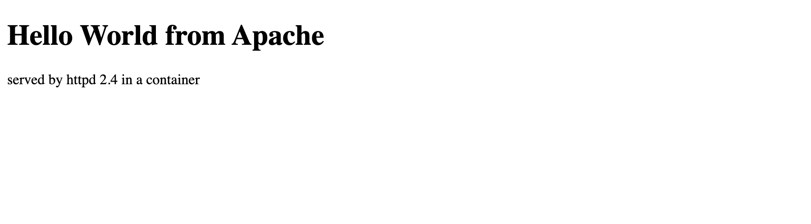
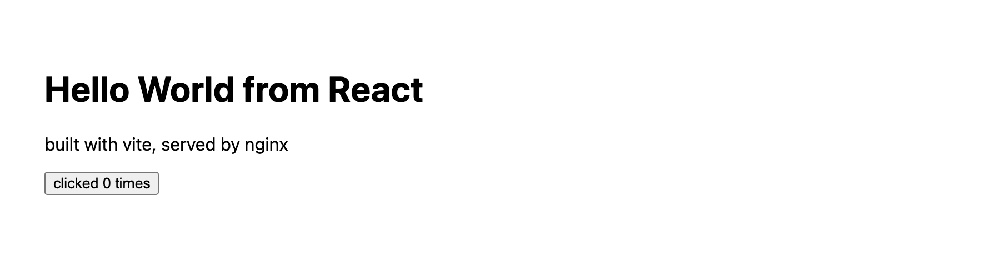

# Docker Fundamentals

Six Hello World web apps, one folder each, own Dockerfile each. All built and run, output at
the bottom.

```
docker/
├── nodejs-app/    node:22-alpine, plain http module        -> 3000
├── python-app/    python:3.12-slim + flask                 -> 5000
├── java-app/      eclipse-temurin:21-jdk, HttpServer       -> 8080
├── Apache-app/    httpd:2.4 + index.html                   -> 80
├── React-app/     vite build, then nginx (multi-stage)     -> 80
└── nginx-app/     nginx:alpine + index.html                -> 80
```

## Build and run

```bash
docker build -t hw-nodejs-app nodejs-app
docker build -t hw-python-app python-app
docker build -t hw-java-app java-app
docker build -t hw-apache-app Apache-app
docker build -t hw-react-app React-app
docker build -t hw-nginx-app nginx-app

docker run -d --name node-hello   -p 3000:3000 hw-nodejs-app
docker run -d --name py-hello     -p 5050:5000 hw-python-app
docker run -d --name java-hello   -p 8200:8080 hw-java-app
docker run -d --name apache-hello -p 8300:80   hw-apache-app
docker run -d --name react-hello  -p 8400:80   hw-react-app
docker run -d --name nginx-hello  -p 8500:80   hw-nginx-app
```

| app | url | container port |
|---|---|---|
| Node.js | http://localhost:3000 | 3000 |
| Python | http://localhost:5050 | 5000 |
| Java | http://localhost:8200 | 8080 |
| Apache | http://localhost:8300 | 80 |
| React | http://localhost:8400 | 80 |
| Nginx | http://localhost:8500 | 80 |

Host ports 5000, 80 and 8081-8091 were already taken on my machine by other containers, so the
left side of `-p` is shifted. The container ports are the normal ones.

## Notes per app

**nodejs-app** - no dependencies at all, just the built-in `http` module, so `npm install` never
runs and the build is instant. `package.json` is only there for `npm start`.

**python-app** - flask pinned in requirements.txt. `requirements.txt` is copied and installed
*before* `app.py` is copied, so editing the app doesn't invalidate the pip layer on rebuild.
`host="0.0.0.0"` matters - bind to 127.0.0.1 inside a container and the port mapping can't reach it.

**java-app** - no Maven or Gradle, just `javac Main.java` at build time and the JDK's own
`com.sun.net.httpserver.HttpServer`. Biggest image of the six at 744MB because it ships a full JDK
(the multistage folder fixes exactly this).

**Apache-app** - httpd serves out of `/usr/local/apache2/htdocs`, so the whole Dockerfile is one
COPY. No CMD needed, the base image already has one.

**React-app** - a real vite build, not a CDN script tag. Two stages: node builds `dist`, then nginx
serves it and the node stage is thrown away. Also has an nginx.conf with
`try_files $uri $uri/ /index.html` so client-side routes don't 404 on refresh.

**nginx-app** - same idea as Apache, docroot is `/usr/share/nginx/html`.

Each page prints the container hostname too, which is the container ID - handy for confirming
you're hitting the container and not something cached on the host.

One thing worth pointing out in the React output: `curl http://localhost:8400` returns only the
shell HTML with `<div id="root"></div>` and a script tag. The "Hello World from React" text is
inside the compiled bundle, which is what you'd expect from a client-rendered app. Fetching the
bundle and grepping it finds the string, and the browser shows the heading.

## Cleanup

```bash
docker rm -f node-hello py-hello java-hello apache-hello react-hello nginx-hello
```

## Screenshots

Captured with playwright against each running container, so these are the pages as a real
browser renders them.

| Node.js - http://localhost:3000 | Python - http://localhost:5050 |
|---|---|
|  |  |

| Java - http://localhost:8200 | Apache - http://localhost:8300 |
|---|---|
|  |  |

| React - http://localhost:8400 | Nginx - http://localhost:8500 |
|---|---|
|  |  |

The React one is the reason a screenshot was worth taking at all. `curl` on that port only returns
`<div id="root"></div>` and a script tag, because the heading is rendered client side. The browser
runs the bundle and the text appears, button and all.

## Output

```console
########## docker images ##########
REPOSITORY                                 TAG           SIZE
hw-react-app                               latest        102MB
hw-nginx-app                               latest        102MB
hw-apache-app                              latest        205MB
hw-java-app                                latest        744MB
hw-python-app                              latest        234MB
hw-nodejs-app                              latest        228MB

########## docker run ##########
$ docker run -d --name node-hello -p 3000:3000 hw-nodejs-app
6a4bd344d9b1645363cf0bedbf1468cf3e8168cbdf01210531b2e84a63583270
$ docker run -d --name py-hello -p 5050:5000 hw-python-app
fbc2b09b9917e049cdfc391419f9a016b82b93f987dfdd1a2acfc33b7c55f9a8
$ docker run -d --name java-hello -p 8200:8080 hw-java-app
6da80fcdd59716331fd73a7ded5588374fe222a7cd8b940ba940a209ca443d41
$ docker run -d --name apache-hello -p 8300:80 hw-apache-app
c28f78311cf94ad4599ed9ed50f207d8cdc23dc1e2197c44f6aa727d7c3e6e39
$ docker run -d --name react-hello -p 8400:80 hw-react-app
b7c1904f05fd17bd7abbd840985ab45c942e1a85dc09d766a86d2dd1014bb98b
$ docker run -d --name nginx-hello -p 8500:80 hw-nginx-app
8ed33d4ad7df73b618708a5a52e5f4b7a253a757fc73d94ab7d6948da141359c

########## docker ps ##########
$ docker ps --filter name=hello
NAMES          IMAGE           STATUS         PORTS
nginx-hello    hw-nginx-app    Up 7 seconds   0.0.0.0:8500->80/tcp, [::]:8500->80/tcp
react-hello    hw-react-app    Up 7 seconds   0.0.0.0:8400->80/tcp, [::]:8400->80/tcp
apache-hello   hw-apache-app   Up 7 seconds   0.0.0.0:8300->80/tcp, [::]:8300->80/tcp
java-hello     hw-java-app     Up 7 seconds   0.0.0.0:8200->8080/tcp, [::]:8200->8080/tcp
py-hello       hw-python-app   Up 8 seconds   0.0.0.0:5050->5000/tcp, [::]:5050->5000/tcp
node-hello     hw-nodejs-app   Up 8 seconds   0.0.0.0:3000->3000/tcp, [::]:3000->3000/tcp

===== Node.js  ->  http://localhost:3000 =====
$ curl -s -o /dev/null -w 'HTTP %{http_code}  %{size_download} bytes  %{time_total}s
' http://localhost:3000
HTTP 200  156 bytes  0.019102s
$ curl -s http://localhost:3000
<!doctype html>
<html>
  <head><title>Node App</title></head>
  <body>
    <h1>Hello World from Node.js</h1>
    <p>host: 6a4bd344d9b1</p>
  </body>
</html>

===== Python  ->  http://localhost:5050 =====
$ curl -s -o /dev/null -w 'HTTP %{http_code}  %{size_download} bytes  %{time_total}s
' http://localhost:5050
HTTP 200  157 bytes  0.009918s
$ curl -s http://localhost:5050
<!doctype html>
<html>
  <head><title>Python App</title></head>
  <body>
    <h1>Hello World from Python</h1>
    <p>host: fbc2b09b9917</p>
  </body>
</html>

===== Java  ->  http://localhost:8200 =====
$ curl -s -o /dev/null -w 'HTTP %{http_code}  %{size_download} bytes  %{time_total}s
' http://localhost:8200
HTTP 200  153 bytes  0.050240s
$ curl -s http://localhost:8200
<!doctype html>
<html>
  <head><title>Java App</title></head>
  <body>
    <h1>Hello World from Java</h1>
    <p>host: 6da80fcdd597</p>
  </body>
</html>

===== Apache  ->  http://localhost:8300 =====
$ curl -s -o /dev/null -w 'HTTP %{http_code}  %{size_download} bytes  %{time_total}s
' http://localhost:8300
HTTP 200  182 bytes  0.002643s
$ curl -s http://localhost:8300
<!doctype html>
<html>
  <head>
    <title>Apache App</title>
  </head>
  <body>
    <h1>Hello World from Apache</h1>
    <p>served by httpd 2.4 in a container</p>
  </body>
</html>


===== React  ->  http://localhost:8400 =====
$ curl -s -o /dev/null -w 'HTTP %{http_code}  %{size_download} bytes  %{time_total}s
' http://localhost:8400
HTTP 200  320 bytes  0.001611s
$ curl -s http://localhost:8400
<!doctype html>
<html lang="en">
  <head>
    <meta charset="UTF-8" />
    <meta name="viewport" content="width=device-width, initial-scale=1.0" />
    <title>React App</title>
    <script type="module" crossorigin src="/assets/index-D1bdyvzZ.js"></script>
  </head>
  <body>
    <div id="root"></div>
  </body>
</html>


===== Nginx  ->  http://localhost:8500 =====
$ curl -s -o /dev/null -w 'HTTP %{http_code}  %{size_download} bytes  %{time_total}s
' http://localhost:8500
HTTP 200  173 bytes  0.001239s
$ curl -s http://localhost:8500
<!doctype html>
<html>
  <head>
    <title>Nginx App</title>
  </head>
  <body>
    <h1>Hello World from Nginx</h1>
    <p>static file served by nginx</p>
  </body>
</html>


===== the React page is a real vite build, so the h1 is in the JS bundle =====
$ curl -s http://localhost:8400 | head -c 400
<!doctype html>
<html lang="en">
  <head>
    <meta charset="UTF-8" />
    <meta name="viewport" content="width=device-width, initial-scale=1.0" />
    <title>React App</title>
    <script type="module" crossorigin src="/assets/index-D1bdyvzZ.js"></script>
  </head>
  <body>
    <div id="root"></div>
  </body>
</html>


$ curl -s http://localhost:8400/assets/$(curl -s http://localhost:8400 | grep -o 'index-[^"]*\.js' | head -1) | grep -o 'Hello World from React'
Hello World from React
```
